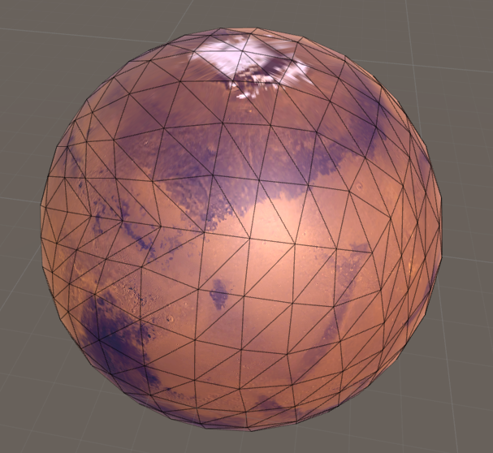
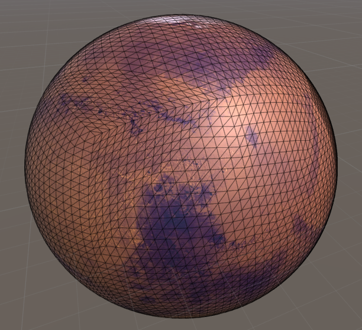
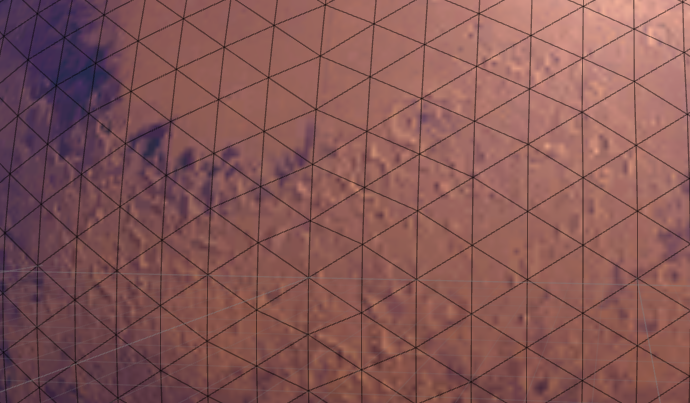
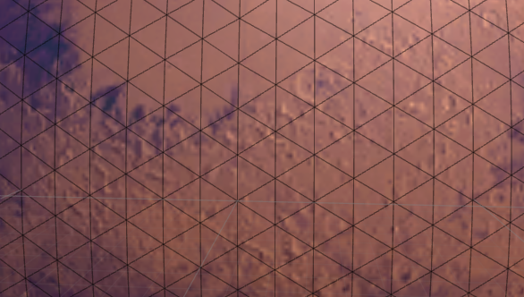
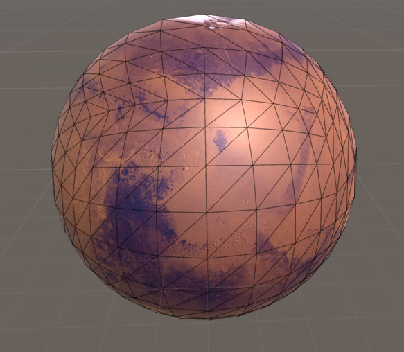
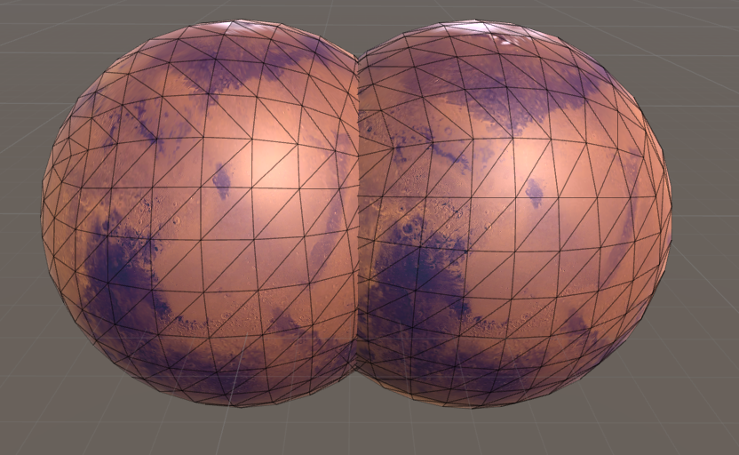
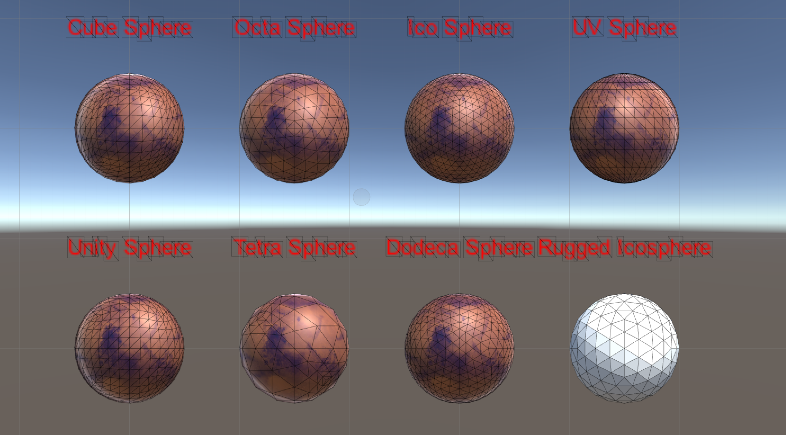
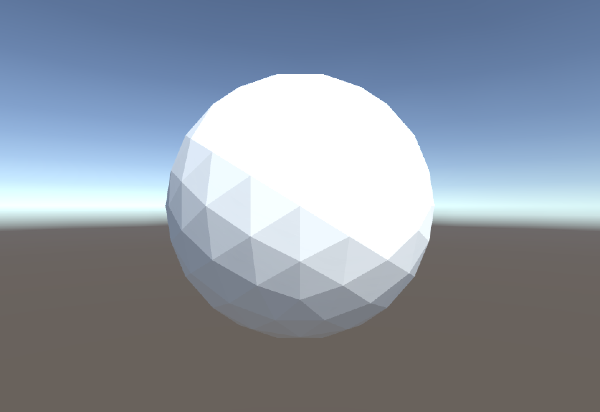

Following my [first post](https://www.alexisgiard.com/icosahedron-sphere/) on generating an Icosphere, I though about how to proceed for a cube sphere and decided to just follow the exact same step as for an icosphere, just starting with a cube and subdividing it. It was pretty straight forward and easier than I thought. Gere is the result.

As you can see something the vertex aren't very well aligned. And the issue gets clearer at higher subdivisions.

The UV mapping from the icosphere still works, so at higher subdivision and without the wireframe it would be hard to see. But it does annoy me a lot now that I know there is an issue. After some re-reading of the code I finally understood. What is happening is that every time I create a new point, I directly push it to it’s spherified position. Then when subdividing again, the triangles' side aren't equal and it makes this warping effect.

<!-- // subdivide the triangles faces
for (int i = 1; i < resolution; i++) {
    List<FaceVertIndices> faces2 = new List<FaceVertIndices>();
    foreach (var tri in faces) {
        
        int a = GetMiddlePoint(tri.IndA, tri.IndB, ref vertices, ref middlePointIndexCache, radius);
        int b = GetMiddlePoint(tri.IndB, tri.IndC, ref vertices, ref middlePointIndexCache, radius);
        int c = GetMiddlePoint(tri.IndC, tri.IndA, ref vertices, ref middlePointIndexCache, radius);

        faces2.Add(new FaceVertIndices(tri.IndA, a, c));
        faces2.Add(new FaceVertIndices(tri.IndB, b, a));
        faces2.Add(new FaceVertIndices(tri.IndC, c, b));
        faces2.Add(new FaceVertIndices(a, b, c));
    }
    faces = faces2;
}

And:
vertices.Add(middle.normalized * radius); -->

This means it's probably an issue with the icosphere as well. As the whole point of making an icosphere was to optimise the density of vertex on the mesh, its another reason to solve it!

To solve this, what I would actually need to do is very simply to do the full subdivision before normalizing the base primitive. And voilà! Way easier than I thought.

It's much better and everything is well aligned. But the cube has the triangle at the center of each face far larger than the ones near the side of the face. I remember I read about this effect on [Catlike Coding's blog](https://catlikecoding.com/unity/tutorials/cube-sphere/) and [here as well](http://mathproofs.blogspot.com/2005/07/mapping-cube-to-sphere.html). The trick is to manually remap the vertices to better fit a sphere. After integrating the equation to my scripts I am pretty happy but it's still not as good as the default unity sphere. I wonder if manually placed the vertices or if they have a better algorythm to remap the vertices. I couldn't find more info on this so I'll keep the current result, but let me know if you do!

*Cubesphere comparison, left: Unity, right: my scrtip*

Now that the work was done for the cube and icosahedron, it was a breeze to add all the [base platonic solids](https://en.wikipedia.org/wiki/Platonic_solid). I also took the opportunity to generalize things a bit and make everything cleaner. Some of the plantonic subdivision do not give very satisfying results. And when you have the cubesphere and icosphere, there are not so many reason to use anything else.

While refactoring I also improved the editor script and added a limit so that you don’t kill your computer by subdividing too much. (I did)

Finally, I always like the non smoothed icosphere look. This requires that each triangle face has unique vertices so that the normal of each vertice is equal to the nornal of the center of the triangle. I added a boolean and an extraloop to do this after the generation was done. It’s not the most efficient way I am sure but it was the easiest to do in the current implementation.

The final thing I would like to do (in a future post) is to integrate a quad tree and subdivide the sphere in terms of distance to the camera and slope of the terrain. This way, it might be possible to have a working full scale planet, which is a bit my end-goal with these scripts.
